# Morandi Lifestyle — Homepage Redesign Blueprint

## Objective
Design a visually rich, mobile-friendly, and category-driven homepage for Morandi Lifestyle, a wellness and sustainable textile brand. The layout should maximize usability, emotional appeal, and conversions while highlighting the story of natural/organic materials.

---

## 1. Competitive & Trend Insights

### firstcry.com
- Sticky, utility-rich header with real-time cart & search autosuggest.
- Deeply category-driven home; each scroll reveals age-specific offers.

### ishalife.sadhguru.org
- Emotion-first hero images and spiritual storytelling.
- Repeating “shop by need” widgets shorten path to products.

### Current DTC & Wellness Trends
- Short, silent hero video loops (≤ 3 MB).
- Social-proof sliders (UGC or reviews) near CTAs.
- AI/behavior-driven recommendation blocks.
- Sustainability scores & certification icons.

---

## 2. Proposed Page Framework

Below is a section-by-section breakdown; see the site map diagram at the end for a quick visual reference.

### Header (sticky, 72 px)
- **Left:** Logo (SVG, links home)
- **Center Nav:** Home | Shop | Stories | Conscious Care | About | Contact
- **Right:** Search (expand on focus) | Wishlist ♥ | Cart 🛒 | Profile 👤/Login
- **Mobile:** Hamburger → slide-in drawer; full-width search bar on open.

### Hero Banner (100 vh ≥ lg, 60 vh md)
- Soft lifestyle loop or rotating stills (mother & baby, hotel bedding, wellness).
- **H1:** “Organic Comfort. Ethical Luxury.”
- Primary CTA “Shop Now” + secondary “Learn More” (scroll to About).
- Overlay trust strip: “♻ 100 % GOTS cotton · 🌱 Plant-based dyes · 🚚 Free shipping ₹ 999+”.

### Shop by Category
Four rounded-corner tiles (radius ≈ 1.5 rem):
1. Maternity & Baby  
2. Healthcare & Hospital  
3. Home & Bedding  
4. Hospitality  
Each tile: static image, hover zoom, “Explore →” overlay.

### Featured This Week
Swipeable carousel (2 cards mobile, 4 desktop) of 6–8 products:
- Image (Next.js `<Image>`)
- Name, price, tag badge (e.g., “Best Seller”, “Organic Cotton”)
- “Add to Cart” button
- Lazy-load; `priority` flag for first two images.

### Seasonal / Thematic Blocks
Grid 2 × 2 or single-row carousel featuring curated collections:
- Baby Showers
- Hospital Packages
- Wedding Return Gifts
- Wellness Retreat Sets

### About Strip
Two-column layout (image left, text right):
- **H2:** “Sustainably Crafted Wellness”
- 80–100 word brand story
- CTA “About Us”

### Newsletter + Contact CTA
- Full-width strip, subtle clay background.
- Email field + “Subscribe” (double opt-in).
- WhatsApp floating action button (WA Business API deep-link).
- Copy: “Stay connected with slow-living inspiration & early access offers.”

### Footer (earthy background)
| Column 1 | Column 2 | Column 3 |
|-------------|----------------|----------------|
| Logo + Tagline + Address | Quick Links (Home, Shop, FAQ, Blog, Sustainability, Return Policy, Privacy Policy) | Social (IG, WA, LinkedIn) + Payment icons (Razorpay, Visa, UPI) |
- Privacy-Policy link → `/privacy` (detailed DPDPA compliance, cookie banner script).

---

## 3. Style Guide Snapshot
| Element | Spec |
|---------|------|
| **Palette** | Sand `#F6F1EB`, Clay `#D6BFA8`, Sage `#8FA391`, Charcoal `#393F3A`, Accent `#C07B5A` |
| **Typography** | Headings → Lato 700; Body → Inter 400; Captions → Nunito 600 |
| **Border radius** | 24 px (`rounded-2xl` in Tailwind) |
| **Shadows** | 0 2 6 rgba(0,0,0,0.06) |
| **Animations** | Framer Motion fade-in-up on section enter; scale-in on hover for product cards |

---

## 4. SEO & Performance Checklist
- Semantic HTML5: `<header>`, `<nav>`, `<main>`, `<section>`, `<footer>`
- Single `<h1>` (hero). Subsequent blocks use `<h2>`.
- Structured data (JSON-LD): WebSite, BreadcrumbList, Product.
- Alt-text with SEO-focused keywords.
- Core Web Vitals targets: CLS < 0.10, LCP < 2.5 s, INP ≤ 200 ms.
- Lazy-load images, self-host fonts (`next/font/local`), `preconnect` CDNs.
- Canonical tag & `og:image` for social share.

---

## 5. Accessibility
- WCAG AA color contrast (≥ 4.5 : 1).  
- Keyboard-reachable nav drawer & carousels (arrow keys).  
- ARIA labels on icons; live-region updates for cart count.

---

## 6. Tech Implementation Hints (Next.js App Router)
- **Components**  
  `<Header />`, `<HeroBanner />`, `<CategoryGrid />`, `<ProductCarousel section="featured" />`, `<ThemeBanners />`, `<AboutStrip />`, `<NewsletterCTA />`, `<Footer />`.
- Data via `/api/homepage` (ISR = 10 min) to hydrate featured & seasonal content.
- Remote images: configure `next.config.js` `images.remotePatterns` (use Cloudinary placeholders for now).
- CSS: Tailwind + `@tailwindcss/typography`.
- Animations: shared `<MotionView>` wrapper.
- Lighthouse goal ≥ 95 mobile.

---

## 7. Roadmap & Next Steps
| Week | Milestone |
|------|-----------|
| 1 | Wireframes (Figma) → stakeholder sign-off |
| 2 | High-fidelity design + micro-interaction prototypes |
| 3-4 | Front-end build, integrate CMS / commerce API |
| 5 | QA (responsive, accessibility), Lighthouse, SEO audit |
| 6 | Launch A/B test hero copy & category order; iterate |

---

## 8. Site Map Diagram

```mermaid
graph TD
    Header["Header | Logo · Nav · Icons"] --> Hero["Hero Banner"]
    Hero --> Category["Shop by Category"]
    Category --> Featured["Featured Products"]
    Featured --> Seasonal["Seasonal Banners"]
    Seasonal --> About["About Brand"]
    About --> Newsletter["Newsletter / Contact"]
    Newsletter --> Footer["Footer"]
```

---

### © 2025 Morandi Lifestyle
Sustainably Crafted Wellness for Every Home 